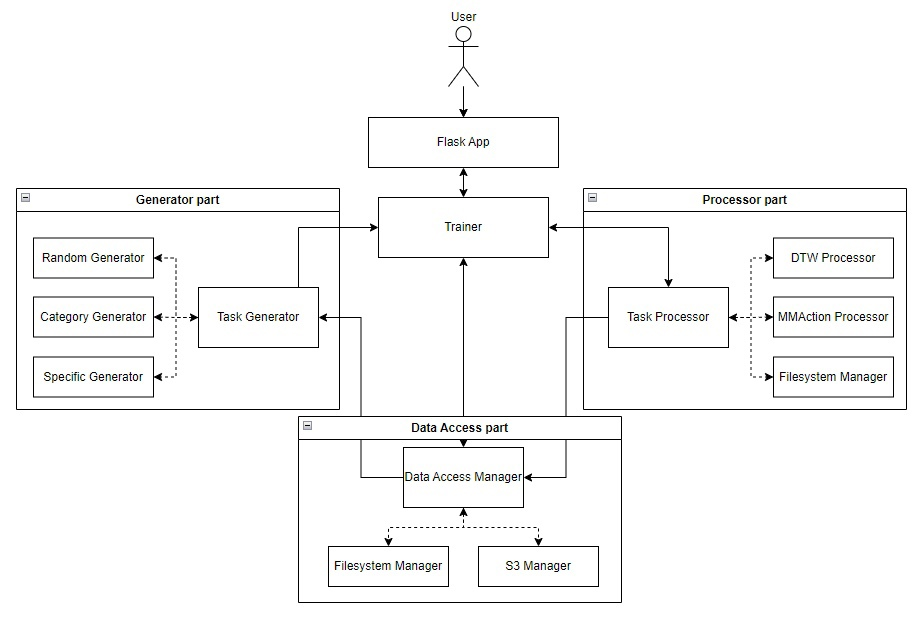
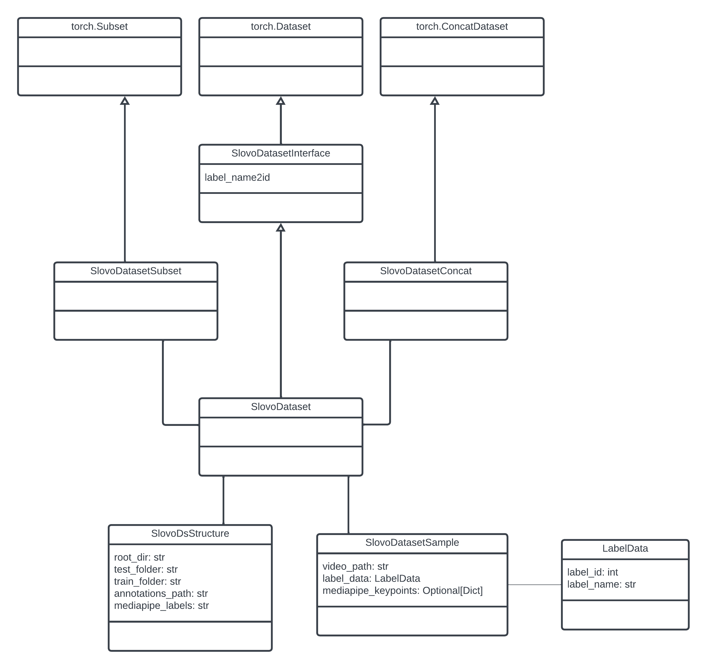

# Тренажер для изучения жестового языка

Задача - сделать инструмент, который позволит слабослышащим людям и людям без отклонений слуха самообучаться жестовому языку.

## Архитектура решения

Основная схема приложения показана на диаграмме:



Структура решения:

[Trainer](src/trainer.py) - базовый класс приложения, реализует фасад, использующий другие части системы (процессоры, генераторы, менеджеры данных).

[Processors](src/processors/) - основной интерфейс для моделей распознавания языка жестов. Модель преобразует видео-файл в текстовую метку класса - распознанного жеста.

[Generators](src/generators/) - интерфейс для генерации заданий.

[Data Access Managers](src/data_access_managers/) - интерфейс взаимодействия с данными. Используются менеджер для файловой системы или для S3 Minio.

## Данные

В данном проекте использовался датасет Slovo 
https://github.com/hukenovs/slovo

Датасет зафиксирован в ClearML, ниже пример кода для получения локальной копии датасета   

```python
dataset = Dataset.get(
    dataset_name="Slovo",
    dataset_project="CVProject",
)
local_copy_path = dataset.get_local_copy()
```

Для работы с данными были написаны классы, представленные на изображении



**SlovoDsInterface** - расширение базового интерфейса torch Dataset своством label_name2id, которое содержит маппинг лейблов 

**SLovoDatasetStructure** - датакласс для упрощения парсинга данных датасета

**LabelData** - датакласс для хранения информации о лейбле 

**SlovoDatasetSample** - датакласс для хранения информации о семпле датасета Slovo

**SlovoDataset** - датасет для работы с данными Slovo

**SlovoDatasetSubset** - расширение torch Subset для вида с сабсетом  лейблов 

**SlovoDatasetConcat** - расширение torch ConcatDataset для конкатенации датесетов реализующих SlovoDatasetInterface

### Генерация дополнительных данных 

В рамках работы над проектом был проработан кейс генерации и разметки новых данных, для этого была написана инструкция для разметки в системе CVAT 
https://www.cvat.ai/

[Файл с инструкцией](assets/CVATLabellinginstructions.pdf)

## Распознавание жестов

### MMAction + TSN

#### Установка mmaction

Установите mmaction по инструкции из репозитория
https://mmaction2.readthedocs.io/en/latest/get_started/installation.html

layout репозитория должен выглядеть примерно так:

```
project
│
└───SignLanguageTrainer
│   
└───mmaction2
```

#### Подготовка данных для обучения TSN

Для обучения TSN необходимо подготовить данные в формате, совместимом с mmaction, для этого необходимо сгенерировать 2 текстовых файла где каждая строка представлена в формате 

*имя_видео* *индекс_класса* 

Пример:
```
01094286-9e5f-4737-a308-8a4a0e5bdfad.mp4 5
02938cc9-a52e-4c1c-b375-2c1d5bff5a94.mp4 4
02a8f308-ec67-40f7-9f4b-4149707825df.mp4 1
035ccc50-c4aa-4592-a305-4c1c9910f4e4.mp4 3
```

Для генерации данных в этом формате используется функция 

```
prepare_data_for_MMAction_training_on_labels_package
```

из *SignLanguageTrainer\train_data_prep.py*


#### Интеграция с SignLanguageTrainer

Для подсчета метрик и логирования в ClearML были реализованы классы для логирования в ClearML и подсчета кастомных метрик, пакет 

```
mmaction_integration
```

#### Подготовка конфига
В конфиг необходимо ввести информацию о сгенерированных данных и кастомных интеграциях с mmaction.

Пример, инициализации кастомных классов в конфиге:

```
val_evaluator = dict(
    type="F1Metric",
    label2id_mapping_path="path/to/label2id_mapping.json",
)

vis_backends = [
    # dict(type="LocalVisBackend"),
    dict(
        type="ExtendedClearMLVisBackend",
        init_kwargs=dict(project_name="CVProject", task_name="train_animals_package"),
    ),
]
visualizer = dict(type="ClearMLExtendedVisualizer", vis_backends=vis_backends)
```


### Mediapipe + DTW + kNN

#### Подготовка данных для обучения

Для обучения модели необходимо обработать видео и выделить и обработать кейпоинты рук и тела с помощью MediaPipe и DTW.

Код для воспроизведения эксперимента представлен в папке **SignLanguageTrainer\mediapipe_dtw_experiment**

1. Сперва необходимо выделить кейпоинты рук и тела при помощи mediapipe.holistic 
2. Затем объединить кейпоинты всех кадров и подготовить данные для расчета DTW-расстояния
3. После, рассчитывая DTW-расстояние между новым видео и обработанными видео из датасета, можно предсказывать жест на основе kNN

#### Пример данных

В качестве примера можно использовать данные из файлов *animals_train_dtw_data.pkl* и *animals_test_dtw_data.pkl*

### OpenPose+LSTM

#### Подготовка данных для обучения LSTM

Для обучения LSTM необходимо обработать видео для создания папок с покадровыми файлами json с кейпоинтами OpenPose. Установить демо OpenPose можно по инструкции:

https://github.com/CMU-Perceptual-Computing-Lab/openpose/blob/master/doc/01_demo.md

Для генерации json-файлов в папке **SignLanguageTrainer\op_keypoint_processing** находятся три файла:
1.	Сначала необходимо поместить видео в папки для тренировочных и тестовых данных с помощью *tofoldr.py*, изменив необходимые параметры.
2.	Далее видео необходимо привести к размеру 1280х* по наибольшей стороне, сформировать видео для разметки кейпоинтов из каждого n кадра с помощью файла *all8th.py*
3.	Далее *thsc.py* запускает команду для разметки кейпоинтов и упаковки json-файлов в папки с названиями видео.

#### Запуск моделей LSTM
Протестировать модели LSTM на папках с полученными файлами json можно с помощью моделей из папки **SignLanguageTrainer\lstm_models** с изменением необходимых параметров.

## Запуск демо

Запуск осуществляется при помощи docker:

```bash
docker build --rm -t signlanguage .
docker run --rm -p 5000:5000 signlanguage
```
